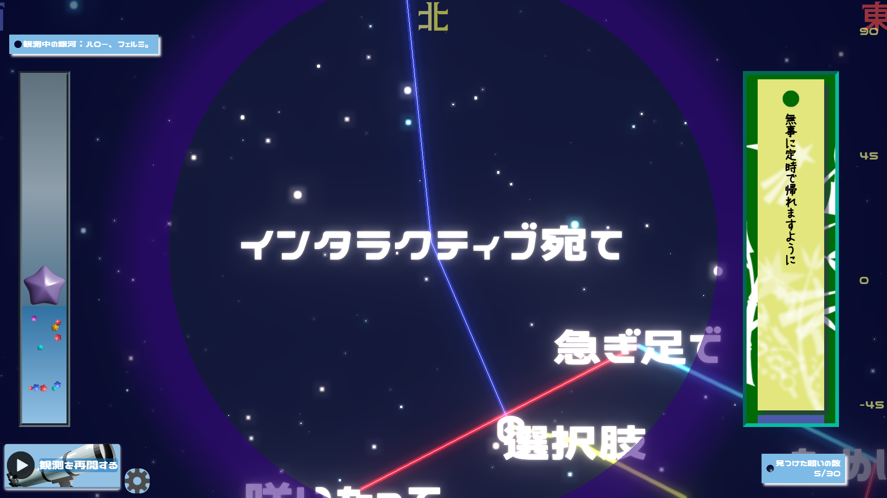

# 題名未定！
## 概要
* [TextAliveAppAPI](https://developer.textalive.jp/)、[Three.js](https://threejs.org/)を用いたリリックアプリです。
* 視点を動かしながら短冊を探し、自分だけの星空を作ることができます。
* 絵心がある人はさらに楽しめるかもしれません。(制作者は絵心が皆無であり、棒人間が限界な人間です。)
* また、作った星空は画像として保存できます。
* 楽曲を用いたコンテンツのほかに、実際の星空を再現した背景も楽しめます。

## コンセプト
本作品では楽曲を「銀河」に、歌詞を「星」に見立てています。<br>
マジカルミライは「『創作』を通じて繋がる場所である」ということと今回のテーマである「星河一天」から、星空の下で想いと想いが繋がる様を表現したいと思い、歌詞(想い)どうしを星座のように線で繋ぐような演出になりました。<br>
また、後述しますがこの作品では(作品内における)時間や場所を変更することができ、それに応じて見える星の場所が(計算上は)正確に移動するようになっています。

しかし、どんなに時間を未来に進めても、場所を変更しても楽曲を用いたメインコンテンツは実行することができます。これは歌詞を人の「想い」と解釈し、「如何なる時でも『創作』は人と人、想いと想いを繋いでくれる」ということや、「一度表現した想いは良くも悪くも、星座の形が変わるほど時間が経ってもずっと残り続ける」ということを表現しています。
(楽曲の歌詞が「悪い」というわけではありません！念のため。)

## 対応環境
### 動作確認済み
* Windows Chrome
* Android Chrome
* IOS Safari

デバイスは**PC**を、ブラウザは**Chrome**を推奨します。<br>
スマホ、タブレット、PC問わず動作するように作ってはいますが、古いスマホやタブレット等ではフリーズする可能性があります。<br>
**Safariの場合、メモリの制限により動作中に強制的なリロードをされる可能性があります。**(動作確認時にこの現象が多発しました。)<br>
また、ジャイロセンサーに対応した端末では視点操作をジャイロセンサーでより感覚的に行えます。

## こだわり
1.**星空**：星空はあくまで背景ですが、観測地点、観測時間によって見える星の場所が再現されており、観測地点や観測時間は変更することが可能になっています。地球の歳差運動や、各恒星の固有運動も考慮されており、各時間、場所においてリアルな星の配置を再現しています。

2.**短冊**:メインコンテンツ内では数多くの「短冊」が登場しますが、これらも歌詞とは別の「想い」です。これらは歌詞がなければただ宇宙空間に浮かんでいるだけですが、短冊が歌詞に届くと短冊が光って消えていきます。「想い」が星に届いて、実際に叶えることができたかはわかりません。しかし、自分以外の「想い」と触れることによって状態に変化が生じたのは確かでしょう。

## 実行方法
### 環境構築
* Node.jsが必要です。
* 以下のコマンドを入力してモジュールをインストールできます。
```
npm install
```
### 開発サーバーの起動
* 以下のコマンドでローカルサーバーが起動します。
```
npm run dev
```
### ビルド
* 以下のコマンドで`dist`ディレクトリにビルド済みファイルが生成されます。
```
npm run build
```

## 簡単なコード解説(もはや備忘録)(コードはあんまり書かない)(←は？)
### 星空の再現に関して
星の赤緯、赤経、bv色指数、等級(<=6.5)、固有運動、HIP番号の値をヒッパルコス星表から取得しています。
#### 1.赤緯、赤経の値を観測地点からの位置に変換する
赤緯、赤経はそれぞれ、天の赤道、春分点が基準となっており、観測地点からの見え方とは異なります。また、これらの値は全てJ2000.0が基準となっているため、実際に再現したい時間のユリウス日をもとに調整する必要があります。
* 固有運動の補正

  ヒッパルコス星表の固有運動の値は1年あたり何ミリ秒角移動するかを、赤経、赤緯それぞれについて記録してあるものです。まずはこれを度数法に直し(/3600000)、J2000.0からの経過年数をかけて、(赤緯方向の固有運動に関しては、さらにcos(赤経)をかけて補正する必要があります。)それを元の赤緯、赤経に加算します。
      
* 歳差運動の考慮

  上記の操作で固有運動を考慮することができたので、今度はそれを使って歳差運動による恒星の移動を計算します。こちらは[astronomia](https://github.com/commenthol/astronomia)を用いて計算しています。

* 観測地域、観測時刻の考慮

   これで地球から見た星の動きが考慮された恒星の赤緯赤経が取得できたため、観測地点の緯度経度、観測時刻を考慮して、観測地点からの見え方を計算します。
   まずは、観測時刻におけるGST(グリニッジ恒星時)を求めます。
 
   `GST = 280.46061837 + (JD - 2451545.0)*1.00273791 * 24 * 15`

  >> JD：観測時刻のユリウス日,
 
  >> 2451545.0：J2000.0におけるユリウス日,
 
  >> 1.00273791:1太陽日＝1.00273791恒星日(理科年表より),
 
  >> 280.46061837:J.2000.0におけるGST(変換サイトから計算したので合ってるかは不明(おい))(Stellariumと同じような場所になってるからきっと合ってる)

  このGSTから観測地点の経度(西経:+,東経:-)を引いたらLST(地方恒星時)の出来上がりです

  これを用いていよいよ観測地点からの見え方を計算できます。<br> 
  計算方法は[こちら](https://astrogreg.com/convert_ra_dec_to_alt_az.html)を参考にしました。<br>
  詳しく知るのは諦めましたが、たぶん球面上の三角形における余弦定理を用いたら導出できるっぽいです。<br>
  今回は上記サイト内の式を用いました。<br>
  天体の赤緯赤経時角、観測地点の緯度経度を用いて計算しています。
  ↓実際のコード
  ``` JS
  const HA_Rad = LST_Rad - RA_Rad;//時角
  const sinAlt = Math.sin(DEC_Rad) * Math.sin(lat_Rad) + Math.cos(DEC_Rad) * Math.cos(lat_Rad) * Math.cos(HA_Rad);
  const Alt_Rad = Math.asin(sinAlt);
  const cosAz = (Math.sin(DEC_Rad) - Math.sin(Alt_Rad) * Math.sin(lat_Rad)) / (Math.cos(Alt_Rad) * Math.cos(lat_Rad));
  const sinAz = -Math.cos(DEC_Rad) * Math.sin(HA_Rad) / Math.cos(Alt_Rad);
  const Az_Rad = Math.atan2(sinAz, cosAz);
  ```
  >>`LST_RAD`：地方恒星時(ラジアン),
  
  >>`RA_Rad`:恒星の赤経(ラジアン),
  
  >>`DEC_Rad`:恒星の赤緯(ラジアン),
  
  >>`HA_RAD`:時角(ラジアン),
  
  >>`lat_RAD`：観測地点の緯度(ラジアン)(北緯:+,南緯:-),
  
  >>`Alt_Rad`:観測地点からの恒星の高度(ラジアン),
  
  >>`Az_RAD`:観測地点からの恒星の方位角(ラジアン)

* 角度情報から3D空間座標への変換

  ここは三角関数の簡単な考え方だけなので軽く書いておきます。↓実際のコード
  ```JS
  const star_x = starDistance * Math.cos(Alt_Rad) * Math.cos(Az_Rad);
  const star_y = starDistance * Math.sin(Alt_Rad);
  const star_z = starDistance * Math.cos(Alt_Rad) * Math.sin(Az_Rad);
  ```
  
※これらの情報は初学者である私が必死にかき集めてきた情報なので、間違いが含まれている可能性があります。
  
#### 2.星の名前、星座名、星座線の取得に関して
星座線のデータ、星座名(学名)は[Stellarium](https://stellarium.org/)の[GitHubリポジトリ](https://github.com/Stellarium/stellarium-skycultures)内のデータ(一部改変)を使用しました。
また、星座名(日本語)は[こちらのページ](https://www.nao.ac.jp/new-info/constellation2.html)より学名と日本語の対応を取得しています。

星の名前はWikiPedia上の[国際天文学連合が固有名を定めた恒星の一覧](https://ja.wikipedia.org/wiki/%E5%9B%BD%E9%9A%9B%E5%A4%A9%E6%96%87%E5%AD%A6%E9%80%A3%E5%90%88%E3%81%8C%E5%9B%BA%E6%9C%89%E5%90%8D%E3%82%92%E5%AE%9A%E3%82%81%E3%81%9F%E6%81%92%E6%98%9F%E3%81%AE%E4%B8%80%E8%A6%A7)
より、恒星のカタカナ表記とHR図における番号(簡潔な表現方法が不明)を取得し、[こちらのページ](https://www.kotenmon.com/star/catalog/hip_4.html)よりヒッパルコス番号とHR図における番号の対応を取得し、恒星のカタカナ表記とヒッパルコス番号の対応を得ています。

### 花火風の演出について
メインコンテンツには、「七夕の短冊(願い)を星に届ける」というものがありますが、この届けた短冊の数が27を超えた場合、歌詞を設置する際に出てくる星のパーティクルが花火のように散らばるようになります。<br>
このパーティクルはそれぞれの星（パーティクル）に対して個別に移動方向が設定されています。しかし、もし単純に「y軸方向に平行な平面上を移動する」といった一様な方向を指定してしまうと、高度（y座標）の絶対値が大きい星ほど視認性が下がり、見た目のバランスが悪くなってしまいます。<br>
そのため、それぞれの星が散らばる方向の基準となる座標軸は、原点から見た位置関係に応じて動的に定める必要があります。<br>
具体的には、**原点**から**歌詞のオブジェクトが置かれた位置**(球面上の任意の点)への**方向ベクトル**と直交する平面上でパーティクルが散るようにします。<br>
こうすることで、星が常に画面に対して自然な向きで広がるようになり、視覚的にも違和感のない表現が可能になります。

* 基準となる平面の軸を作る

  まず歌詞のオブジェクトが置かれた座標における、球面との接平面の法線ベクトルを求めます。<br>
  次に、この**法線ベクトルと直交する1本目のベクトル**(軸1)を計算します。今回は、成分が (0, 1, 0) のベクトルとの外積で作成し、ほぼ平行だった場合は (1, 0, 0) に切り替えています。<br>
  次に、**2本目のベクトル**(軸2)を計算します。このベクトルは、法線ベクトルとも、軸1とも直交している必要があるため、この2つのベクトルの外積で求めます。<br>
  以下がそのコードです<br>
  ```JS
  const normal = new THREE.Vector3(position.x, position.y, position.z).normalize();//(0,0,0)から目標座標への単位ベクトル
  const temp = new THREE.Vector3(0, 1, 0);
  if (Math.abs(normal.dot(temp)) > 0.99) {//内積が1だと平行だよね(単位ベクトルどうしの場合)
      temp.set(1, 0, 0);  // ほぼ平行な場合は別の軸を使う
  }
  this.axis1 = new THREE.Vector3().crossVectors(normal, temp).normalize();
  this.axis2 = new THREE.Vector3().crossVectors(normal, this.axis1).normalize();
  ```
  これで平面の軸を求めることができました。あとは移動方向を計算するだけです。

* 自分で作った座標平面上で移動方向を計算する

  直交する座標軸（たとえば XY平面）上で、角度θ方向に進むときの座標は一般に以下のように求められます：

  `X=cosθ`
  
  `Y=sinθ`

  ここで、この式の意味を考えてみます。<br>
  これらの式は、<br>
  「**x軸方向の単位ベクトルにcosθ倍、y軸方向の単位ベクトルにsinθ倍のベクトルを足し合わせた結果**」として表現されています。<br>
  つまり、各軸の単位ベクトルにそれぞれ重みをつけて加算するという意味になります。<br>
  今回は軸が`this.axis1`と`this.axis2`であるため、以下のようなコードになります。<br>
  ```JS
  // 軸1にcosθ、軸2にsinθの重みをかけて合成する
  for (let i = 0; i < this.count ; i++) {
      if(i<20){
          const angle = (Math.PI * 2 / 20) * i;
          const direction = new THREE.Vector3()
              .addScaledVector(this.axis1, Math.cos(angle))
              .addScaledVector(this.axis2, Math.sin(angle));
          dir = direction.clone().multiplyScalar(0.06);
      }else if(20<=i&&i<40){
          const angle = (Math.PI * 2 / 20) * (i-20);
          const direction = new THREE.Vector3()
              .addScaledVector(this.axis1, Math.cos(angle))
              .addScaledVector(this.axis2, Math.sin(angle));
          dir = direction.clone().multiplyScalar(0.12);
      }else{
          const angle = (Math.PI * 2 / 20) * (i-40);
          const direction = new THREE.Vector3()
              .addScaledVector(this.axis1, Math.cos(angle))
              .addScaledVector(this.axis2, Math.sin(angle));
          dir = direction.clone().multiplyScalar(0.09);
      }
  }
  ```
  (めっちゃ冗長で草)
  こうすることにより、花火のように多方に散らばるような演出を作ることが可能になります。

### 歌詞の区切りについて
歌詞は視点を移動させた先に歌詞が表示されますが、TextAliveAppAPIで取得できる歌詞の単位は(制作者が試した限りだと)「1文字」「1単語」「歌詞カード1フレーズ」であったのですが、前2つだと表示されるペースが速すぎてメインコンテンツの難易度が上がってしまったり、記号(感嘆符や鍵括弧等)が1文字で単語扱いになっていたためバラバラに表示されたときに意味として理解しにくかったり、しかし1フレーズ丸々では長すぎてテンポが悪いと感じてしまいました。<br>
それらを解決するため、歌詞の区切りを自分で調節するコードを作りました。主に
* 助詞、助動詞は前の単語とくっつける(*例1)
* 連続する名詞どうしはくっつける(*例2)
* しかし、それらの単語がくっつける先頭の単語と1小節の半分の拍以上離れていたらくっつけない(*例3)
* 基本的に先頭に来る記号("("や"「")は後ろの単語(*注1)とくっつける(*例4)
* 基本的に末尾に来る記号(")"や"」")は前の単語(*注1)とくっつける(*例4)
が挙げられます。

* 注1: ここで言う「単語」は助詞や助動詞、名詞をくっつける処理を適応済みのもの(のはず)

例1<br>
<br>
例2<br>
<br>
例3<br>
<br>
例4<br>


(問題はこのコードを考えなしに作り始めてカオスなパズルをする羽目になったことですかね...)<br>(**一応**制作者は中身を説明できるようにはなってるので許してください)

### 表示する歌詞の色、大きさについて
文字の色、明るさは[V/A空間の座標値](https://developer.textalive.jp/packages/textalive-app-api/interfaces/ValenceArousalValue.html)を、大きさは声量をもとに決定しています。<br>
これらの値は曲内の相対的な変化ではなく曲間で比較可能な絶対値であるため、このまま用いると曲によって偏りが生じてしまいます。そのため、曲の再生前に全てのデータ(全ての単語の先頭のタイミングにおけるデータの意)を取得し、最大値と最小値取得して割合で表しています。こうすることで曲内での相対的な変化に着目できます。<br>
(ちなみにこれらの処理は表現云々というよりは作品に彩りを持たせる目的の方が大きかったりします。)

* 具体的な色の決定方法

  文字の色はV/A空間の座標値の内、A(覚醒度)の値を用いています。これの楽曲中での値の割合をもとにB-V色指数と同じような尺度の値に変換し、それをRGB化することで覚醒度の値を恒星の色に変換しています。<br>
  Aが大きいほど青白く、小さいほど赤くなるようにしています。

* 明るさと大きさ

  大きさは声量の割合が大きいほど大きく、明るさはV/A空間の座標値の内、V(感情価)が大きいほど明るくしています。それだけですかね。はい。

### 文字の表示位置について
文字の設置位置はカメラの向いている先になるようにしていますが、ただ視点の先に設置するだけでは設置する時間の間隔が短かったり、視点の操作がゆっくりすぎる場合は文字同士が重なってしまう懸念が存在します。<br>
それを避けるため、視点の先に既に歌詞がある場合はランダムな方向に歌詞を移動させて設置させるような処理を入れています。(制限あり)<br>
こうすることで文字の視認性が高まり、広い空間を有効に活用することが可能となっています。

### 正距円筒図法による画像の出力について
[こちら](https://campkougaku.com/2023/03/21/cube-map2/)を参考に、<br>
1. CubeMapを取得
2. CubeMapを正距円筒図法で全天球画像に変換

という手順で作成しています。

考え方はまるっきり上記サイトを参考にしているのでここで多くは語りません。

(上記サイトで行われている「のりしろ追加」に関しては~~めんどくさかったので~~実装していません)
(不慣れなJSだからしょうがない)(Pythonならやってた。)

## その他使用ライブラリ

* astronomia（MIT License）  
  Copyright (c) 2013 Sonia Keys  
  Copyright (c) 2016 Commenthol  
  [GitHub リポジトリ](https://github.com/commenthol/astronomia)

## 使用データ

### Stellarium Skycultures - Western
* データ元: [stellarium/stellarium-skycultures](https://github.com/Stellarium/stellarium-skycultures)
* 該当ファイル: `western/index.json`(本プロジェクトでは`/src/index.json`に使用)
* 著者: Stellarium's team

  **ライセンス情報**  
- `stellarium/stellarium-skycultures/western/index.json`（元データ）: [Creative Commons Attribution-ShareAlike (CC BY-SA)](https://creativecommons.org/licenses/by-sa/4.0/deed.ja)  
- `/src/index.json`（改変後のデータ）: 同上（CC BY-SA）

  **変更点**
- 元データの 583 行目および 598 行目に記載されていた `"thin"` を削除しました。
